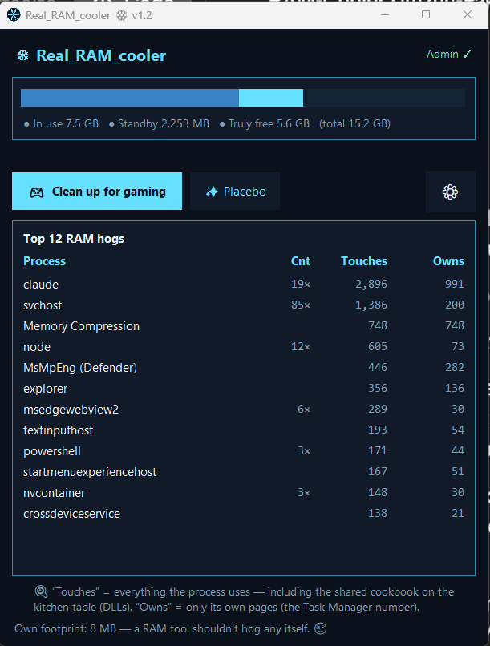

# Real_RAM_cooler ❄

🇩🇪 **[Deutsche Version → README.de.md](README.de.md)**

**An honest RAM tool for Windows.** Purges the standby list using the same mechanism as RAMMap and ISLC — the only thing that actually helps against gaming stutter caused by a bloated memory cache. No magic, no "boost", no promises Windows can't keep.

    



---

## What it does — and what it doesn't

| | |
|---|---|
| 🎮 **Clean up for gaming** | Purges the Windows standby list via the native API (`NtSetSystemInformation`). That's the real ISLC/RAMMap mechanism — genuinely helps against micro-stutter when the standby cache has bloated up after long sessions. |
| ✨ **Placebo mode** | Trims the working sets of all processes. Makes the Task Manager numbers pretty, does **not** make your PC faster — Windows shoves everything into Memory Compression and takes it right back. Built in as a joke and honestly labeled, because 95% of "RAM boosters" out there sell exactly *that* as their main feature. |
| ❄ **Automatic (ISLC style)** | Optional: purges automatically when the standby list **and** free RAM cross configurable thresholds. Off by default — the app does nothing unasked. |

## Features

- **Bilingual (since v1.2):** English + German, starts in your Windows display language, switchable in the settings
- **A RAM bar that tells the truth:** in use / standby / *truly* free — not the fuzzy "available"
- **Top 12 RAM hogs with two columns:** "Touches" (working set incl. shared DLLs) vs. "Owns" (private working set — the Task Manager number). Understand it once, never wonder again
- **Before/after** on every cleanup: `Standby: 1,240 MB → 85 MB ✓`
- **Tray app:** right-click the snowflake icon → clean up without opening a window
- **Optional mini overlay** (semi-transparent, draggable) with live values
- **Autostart** via Task Scheduler — without a UAC prompt at every boot
- **Own footprint ~10–15 MB** — a RAM tool shouldn't hog any itself

## Installation

1. Download the latest `Real_RAM_cooler_Setup_….exe` from the [Releases](../../releases/latest)
2. Run the setup → click through → done

> **⚠️ "Unknown publisher" / SmartScreen?** Normal. The app is not code-signed (certificates cost several hundred € per year — no open-source hobby project pays that). The full source code is right here in this repo; you can read every line and build the app yourself. At the warning: **"More info" → "Run anyway"**.

> **🛡️ Admin rights?** Yes, at every start (one UAC click). Windows only allows purging the standby list with admin rights — the same requirement as RAMMap and ISLC. There is no way around it, technically.

## For gamers — the 30-second guide 🎮

1. **Before playing:** right-click the snowflake in the tray → **"🎮 Clean up for gaming"**. Done.
2. **On long sessions** (or when it stutters after 2–3 hours): enable **Automatic** in the settings. Recommended values for 16 GB RAM: purge when standby > 1024 MB and free < 1536 MB. With 32 GB, double both values.
3. **No in-game overlay needed** — the app works invisibly in the tray and barely eats anything itself.
4. **Honest expectations:** this tool fixes stutter caused by a bloated standby cache. It doesn't conjure FPS out of thin air, doesn't overclock anything, and doesn't replace a RAM upgrade. Anyone promising you that is selling you the placebo button as their main feature. 😉

## Configuration

All settings live in the `config.json` next to the `.exe` (when installed: `C:\Program Files\Real_RAM_cooler\`). Adjustable via the ⚙ menu; two values can also be changed in the file:

```json
"overlay_alpha": 0.28,
"language": "auto"
```

`overlay_alpha`: overlay opacity — `0.15` = ghost 👻, `1.0` = solid. `language`: `"auto"` (Windows language), `"de"` or `"en"`. Restart the app, done.

## Build it yourself (open source!)

```powershell
pip install pystray pillow
python real_ram_cooler.py --make-icon                    # creates icon.ico
python -m PyInstaller --onefile --noconsole --uac-admin --icon icon.ico --name Real_RAM_cooler real_ram_cooler.py
```

Build the installer: compile `setup.iss` with [Inno Setup 6](https://jrsoftware.org/isinfo.php) (Ctrl+F9).

## FAQ

**Why does Task Manager show different numbers than the "Touches" column?**
Task Manager shows the *private* working set (own pages only); "Touches" also counts shared DLLs. Both numbers are correct — they answer different questions. That's why the app shows both.

**After the placebo button, `Memory Compression` is huge — bug?**
Feature. That's exactly what happens to "trimmed" memory: Windows compresses it instead of freeing it. The button exists to demonstrate this live.

**Windows Defender doesn't like the freshly built .exe?**
Fresh, unsigned PyInstaller exes are often flagged as false positives. When building yourself: add the project folder as a Defender exclusion first.

**Does it work with 8 GB / 32 GB / 64 GB RAM?**
Yes. The automatic thresholds are sliders — adjust them to your RAM size.

## License

MIT — use it, read it, fork it, improve it. See [LICENSE](LICENSE).

---

*Built in one night session by Dennis ([@Dennismit2n](https://github.com/Dennismit2n)) with Claude — including live proof of why RAM boosters are snake oil. The app is the protocol of that night.* ❄💙
